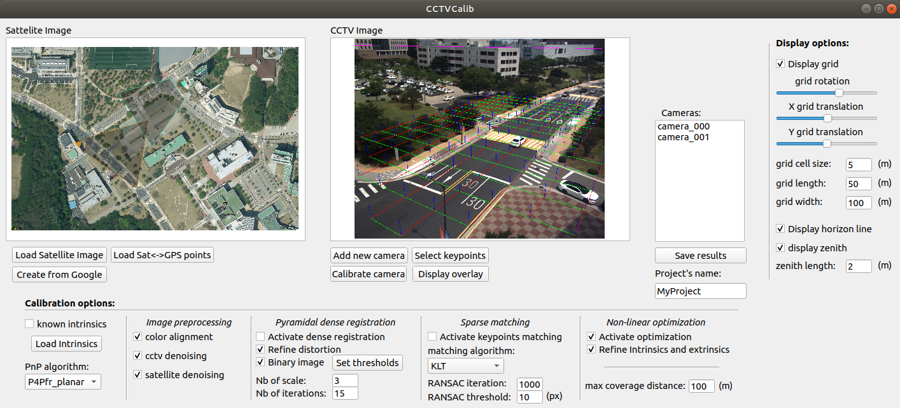

<p align="center">
  
</p>

## Introduction
CCTV-Calib is a python toolbox to calibrate outdoor CCTV cameras via satellite images. 
Further technical details can be found in the [paper]().
Important notice: A mouse with a wheel is required to properly use the toolbox.

<figure>

<figcaption align = "center"><b>Fig.1 - Main Calibration module</b></figcaption>
</figure>

## Dependencies
PyQt
OpenCV

## Tutorial

# Run CCTV-Calib

To run the toolbox, simply type ```python cctv_calib.py``` in the terminal.

# Prepare the satellite view

A pre-requisite is to have a satellite of the scene observed by the surveillance camera. CCTV-Calib contains a module to automatically extract download the appropriate satellite image and to generate the associated meta-data. To generate this image from Google Maps, press ```Create from Google``` and a new window will pop, here you need to set your [Google API key](https://developers.google.com/maps) and the longitude and lattitude GPS position of the camera via the fields ```lon``` and ```lat``` (WGS84). Finally, the image can be generated by pressing ```Generate image``` (do not forget to unzoom using the mouse wheel to be sure to see the entire picture). The zoom of the image can also be adapted, when the satellite view is satisfying it can be saved by pressing ```Save image and points```. Two image will be created, namely, the picture ```your_satellite_image.png``` and the *.yml file ```your_satellite_image.yml```. 
This yml file is composed as follows:
```bash
%YAML:1.0
---
pts_gps: !!opencv-matrix
   rows: 4
   cols: 2
   dt: d
   data: [ 3.5694351284978481e+01, 1.3969852068607256e+02,
       3.5694351284978481e+01, 1.3970023729984209e+02,
       3.5692957140277940e+01, 1.3970023729984209e+02,
       3.5692957140277940e+01, 1.3969852068607256e+02 ]
pts_sat: !!opencv-matrix
   rows: 4
   cols: 2
   dt: d
   data: [ 0., 0., 1280., 0., 1280., 1280., 0., 1280. ]
```
This file contains the gps points and their corresponding pixelic location.
If you do not want to spend money on Google Maps, you can also create this file yourself by providing at least 3 corresponding points yourself.

1. Load the satellite image

Now that your satellite image is ready, you can open it in CCTV-Calib: ```Load Satellite Image```. Then load the corresponding metadata containing the correspondences via ```Load Sat <-> GPS points```, if you do not load this data, the calibration will not be done at a metric scale and the GPS position will be not computed properly.

2. Add a CCTV camera to be calibrated
CCTV-Calib has the ability to calibrate multiple camera from a single satellite image. To include a new CCTV camera ta be calibrated, simply press ```Add new camera``` and select the image/video acquired from the camera of interest (if a video is loaded, a background substration will be processed which can take up to a few minutes depending on the size of the video). Then the image will appear on the right handside.

3. Select cctv<->satellite correspondences
Now it is time to select a set of correspondences between the satellite and the cctv images. Press the button ```Select keypoints``` to open the keypoints module. 
First you can set the number of points you would like to provide, note that a minimum of 4 points are requiered to calibrate a perspective camera without distortion. Usually 6 or 7 points are sufficient to calibrate any traffic surveillance camera. Then you zoom (mouse wheel) and navigate through the image (by pressing the wheel of the mouse). The right mouse button can be used to set a ROI on the satellite image and to zoom on the cctv image.
The point correspondance can be selected with a left click, when a corresponding keypoint is selected on both images, it is possible to move to the next keypoint by pressing ```space``` (space will reset to view to the last ROI selected on the satellite view) or ```N``` or by manually changing the value in ```current points```. 
When all the keypoints have been set, you can press ```Apply```.


4. Set your pose estimation algorithm
Now you can proceed to the camera calibration, by default only the correspondance you have selected will be used for the calibration. You can directly calibrate the camera by pressing ```Calibrate Camera``` and check the validadity of the resulting parameters by inspecting the resulting image overlay ```Display overlay```. Looking at the distortion correction, grid and horizon line, gives also good indication regarding the quality of the calibration (in the main window).
If you are not satisfied with the obtained results, you can modify the pose estimation algorithm ```PnP algorithm```. For instance, if the camera contains a limited amount of distortion, the option ```P4Pf``` or ```homography``` might lead to be results. If you do not want to refine the intrinsic parameters of the camera (for instance if you want to assume zero radial distortion) the option ```Refine Intrinsics and extrinsics``` can be unticked. Note that the RANSAC threshold can also be adjusted accordingly with your image resolution.

5. Include refinement techniques
CCTV-Calib contains two refinement strategies that can be used jointly or individually. The first one is a dense registration techniques that can be activated via ```Activate dense registration```. This dense registration can be achieved by minimizing the photometric difference between the CCTV and the warped satellite image or by using a binarized version of them (in order to segment the roadmarkings). The user can set the binary thresholds at will via the module ```Set thresholds```.
When the cctv and satellite images are too disimilar this refinement option can be kept deactivated. Alternatively, a sparse matching strategy can be used, this option can be activated via ```Activate keypoints matching```. The KLT algorithm usually provides satisfying results (GMS matching can also be used but is often resulting in less accurate calibration).
After you have selected your refinement preferences you can press ```Calibrate camera```.

6. Add additional cameras
You can include as many cameras as you would like and calibrate them. They will all appear on the satellite view and you can freely navigate between different cameras.

7. Saving your results
Set your project name and press ```Save results```.
The resulting calibration is stored in one *.yml file per camera.

## Shortcoming
Over trials over surveillance cameras around the world, CCTV-Calib mostly provided accurate and stable results. However, it still suffer a certain number of limitations that we are listing here:
- The satellite image is assumed to be an orthographic view
- The correspondances are assumed to lie on a planar surface (thus the presence of roadmarkings is preferable)
- If the roadmarkings have been modified between the capture of the cctv image and the satellite image, it makes the calibration rather complex and the refinement techniques cannot be applied
- The cameras are calibrated individually even if they share a field of view
- The principal point located in the center of the image is assumed


